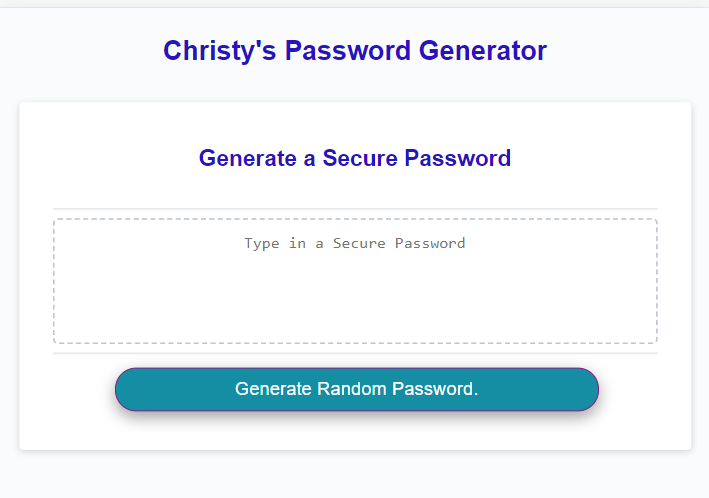

# Christy's Random Password Generator

## URLs

- GitHub Repo URL: https://github.com/ChristyGHanson/JS-Password-Generator
- Deployed App URL:

## Description
Create an application that generates a random password based on user-selected criteria. 
This app will run in the browser and feature dynamically updated HTML and CSS powered by your JavaScript code. 
It will also feature a clean and polished user interface and be responsive, ensuring that it adapts to multiple screen sizes.

# How to Use Christy's Password Generator

1. Click the button that reads "Generate Password."
2. Type in a number between 8 and 128. This is your password's length. Click OK.
3. Click OK if you would like lowercase letters, uppercase letters, special characters, and numbers.
4. The password will randomly generate and appear in the text box.

# Technology Used

In addition to HTML, CSS, and JavaScript, we used the following technology for this website.

* [Font Awesome](https://fontawesome.com/) provides a collection of free icons and toolkits (you have to make a free account). 
* The [W3Schools "CSS Buttons" article](https://www.w3schools.com/css/css3_buttons.asp) was helpful in styling the button.

