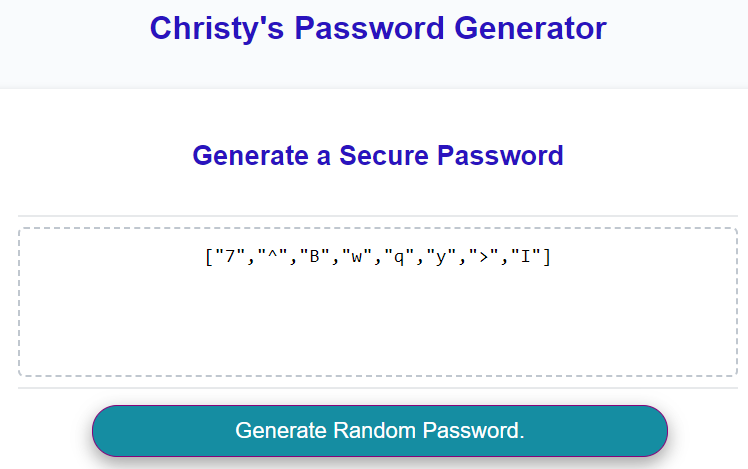

# Christy's Password Generator

## URLs

- GitHub Repo URL: https://github.com/ChristyGHanson/christys-password-generator
- Deployed App URL: https://christyghanson.github.io/christys-password-generator/

## Description
* Create an application that generates a random password based on user-selected criteria. 
* This app will run in the browser and feature dynamically updated HTML and CSS powered by your JavaScript code. 
* It will also feature a clean and polished user interface and be responsive, ensuring that it adapts to multiple screen sizes.

# How to Use Christy's Password Generator

1. Click the button that reads "Generate Random Password."
2. Type in a number between 8 and 128. This is your password's length. Click OK.
3. Click 'OK' if you would like lowercase letters, uppercase letters, special characters, and/or numbers.
4. The password characters will randomly generate and appear in the text box.

Note: If you do not choose any character type, you will be prompted to start over by clicking the 'Generate Random Password' button.

